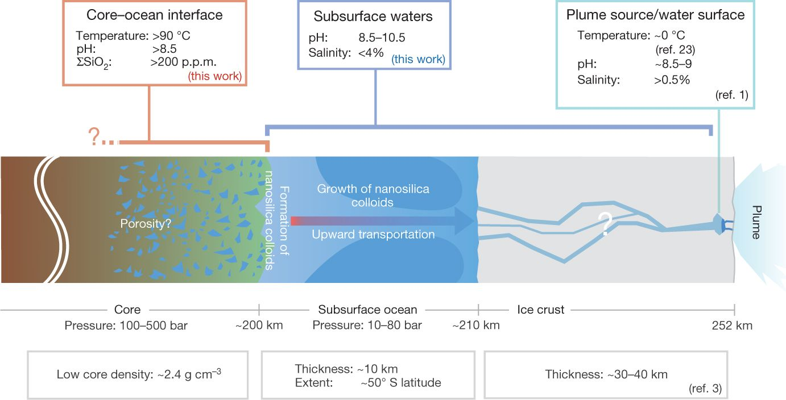

### Gathering Data

- Use KEGG_REST_API to download list of all KEGG:

  - enzymes http://rest.kegg.jp/list/enzyme
  - compounds http://rest.kegg.jp/list/compound
  - reactions http://rest.kegg.jp/list/reaction
  - (and current KEGG stats/info) http://rest.kegg.jp/info/kegg
  - This can also be done for the other KEGG database entries, listed here: http://www.kegg.jp/kegg/docs/dbentry.html

- Use the TogoWS database + Biopython's TogoWS module, and loop over each database entry (from the database.txt files download above) while extracting from the TogoWS database (which is kept in sync with the KEGG database. e.g. It is updated at least every day from spot checking it).

  - http://togows.dbcls.jp/
  - See module documentation here. There are no examples, but data can be pulled simply by calling the `.entry` attribute. This returns a `handle` . Calling `handle.read()` will return the data, which can be written out to a file in the standard way python files are written out.
    - http://biopython.org/DIST/docs/api/Bio.TogoWS-module.html
  - this is done using the `generate_entry_files.py` to generate json files for `reactions`,`compounds`, and `enzymes`

- Parse the `reactions` `.json` files in order to extract and store (in a better way than how they are stored from pulling) the compound IDs associated with a reaction's substrates and products. These are stored in the `reactions_detailed` directory. These jsons are updated with 5 additonal fields if they do not contain glycans as part of the reaction. The fields are: `substrates`,`products`,`substrate_stoichiometries`,`product_stoichiometries`,`glycans`. All fields except `glycans` contains lists of strings. `glycans` is a boolean value. The lits of `substrates` and `substrate_stoichiometries` (for example) contain lists whose elements match up the compound ID to the stoichiometries. Some stoichiometries are letters (`n` or `m`). This will form the basis of the information from which to construct an updated KEGG network, and the data which can be used expanding networks from seed compounds.

  - This is done using a lot of regex in the file `add_substrates_products_stoichiometry_to_reaction_jsons.py`

  - A `.json` was created using `generate_reaction_substrate_product_edges_json.py` that contains a structure like:

  - ``````json
    {
      "products": {
        "R07881": [
          "C14101", 
          "C00010"
          ],...
      }, 
      "substrates": {
        "R07881": [
          "C14120", 
          "C00001"
        ],...
      }
    }
    ``````


- 
- Figure out the best way to store the reaction/compound data for easily converting to a networkx graph object.
  - I'm thinking the easiest way would be to add fields directly to the existing reaction jsons:
    - substrate field
    - product field

### Creating reaction scopes

- Use objects to construct labeled graphs
- Create lists of which compounds can be reached from each other compound in x number of steps

### Notes

There appear to be duplicate reactions amongst all the reaction ids. For example, `R04193` is the same as `R06183`. I believe this only happens when a reaction involves glycans. Glycans appear to be degenerately stored as both compounds and glycans, in both the compound and glycan database. For example, `C03323 == G10497`, and this compound is known as all of the following: `"1,2-beta-D-fructan:1,2-beta-D-fructan 1F-beta-D-fructosyltransferase"`.

### Log

- Dec. 13, 2017: I've identified 3 compound IDs which are present in some reactions' substrate and product lists, but which do not have official entries in KEGG COMPOUND. e.g. they are in:

- ```python
  substrates = nx.get_node_attributes(G,"substrates")

  products = nx.get_node_attributes(G,"products")

  ```

- but not in:

  `reactions = nx.get_node_attributes(G,"reactions")`

  

- These are:

  - C009991 (found in R11044), labeled as Ferrocytochrome b51, no hyperlink in REACTION db. Not listed in the ENZYME db (1.14.19.6). I suspect this is a typo based on this, and this enzymes other reaction (R11043). It should likely be C009999 (Ferrocytochrome b5).
  - C03061 (found in R08652), labeled as 2-Methylhomogentisate. Broken hyperlink in REACTION db. Not listed in the ENZYME db ([1.14.14.40](http://www.kegg.jp/dbget-bin/www_bget?ec:1.14.14.40)). I do not think this is a typo.
  - C21593 (found in R11803), labeled as D-Erythronate. Broken hyperlink in REACTION db. No hyperlink in the ENZYME db. I do not think this is a typo.

- Added:

- ```python
  ## remove reactions which contain compounds that don't exist
  entriesToRemove = ['R11803', 'R11044', 'R08652']
  for k in entriesToRemove:
      reactions.pop(k, None)
  ```

  to the function `advance_expansion_1_generation`

- reformatted the removal of reactions to functions (1/18/18)

- Ran through multiple seed sets

### 9-20-18

Tasks:

- See how different network expansion is without O2 reactions
- Visualize networks in expansion (see Fig. 1 in Goldford et al.)
- Figure out AA enrichment/depletion relative to composition of enzymes used by life in an Enceladus like environment. If I assume I need all amino acids in order to be able to catalyze everything in KEGG, just need to see if I can make all amino acids with the enceladus network expansion
  - to do this for individual organisms, it requires identifying the genes which code the ECs which catalyze the reactions. And then looking at the presence/absence of AA in the enzymes coded by those genes.
- Look into annotated genomic data for organisms which can hitch rides on clean spacecraft--do network expansion on their reaction sets
  - Looks like there have been some of these completely sequenced and annotated! 
  - Check how reliant these organisms are on other organisms to survive. e.g. do people know that these are autotrophs or chemoautotrophs? how do people know that? How can i interpret the quantitative results of network expansion to figure out if this organism is viable or not? e.g. how to quantify if organism has access to the right molecules needed for growth and reproduction?
- Look into most "minimal" , "resiliant", or "autotrophic" organisms and do network expansion on their reaction sets
- Look into research on whether the molecules we've observed from enceldaus's plume, e-rings, etc are accurate predictions of the available substances in the ocean.
- Look into the metal availability on spacecraft--could these fufull the requirements necessary for metal cofactors?

Notes:

- Only L amino acids used in proteins and by cells. What about beta amino acids? These seem superfluous (via John), don't need to condider anything but L for purposes of life.
- 

Sara notes:
- Try different genomes/metagenomes on enceladus and goldford. Can you get organisms that create amino acids, or "core metabolism", or anything?
- Might try to pick the largest organisms, or most complete genomes
- Combine all clean room or rad-hardened organisms in one network expansion since individual ones don't seem to be working.

### 9-24-2018 Monday

- Use Biopython and KEGG REST API to get mappings between:
  - paths (maps) and reactions (and vice versa)
  - paths (maps) and compounds (and vice versa)
  - reactions and compounds (and vice versa)
  - And download description data and lists of each of these things.
- Goldford used KEGG map IDs to test for pathways enrichment, as well as KEGG MO module IDS to test for module enrichement, but only pathway enrichment was plotted (this is a higher level)
- e.g. `http://rest.kegg.jp/link/reaction/map00471`
- rewrite network expansion algorithms using matrices and make sure they yeild same results. Can run them with Pypy to go faster this way.
- Figure out how the F Goldford did http://www.biostathandbook.com/fishers.html fisher's exact test on the pathway enrichment. Need to talk to a bio person... Then it is straightforward to do Benjamini-Hochberg multiple comparison test to make sure False Discovery Rate (FDR) is small http://www.biostathandbook.com/multiplecomparisons.html 
- Check handwritten notes for incorporating phosphorous compounds in Enceladus network expansion (looks like best bet is planting P2O5 or H(PO3)- and assuming it came from schriberite or apatite, and will exist even if it is at low concentrations in enceladus's ocean. Steve Desch thinks weathering will be small for an ocean at pH of 9-11 but Shock thinks it will still exist, just below detection limits for Cassini.)
- Run network expansion for different seed sets to see just how much the compounds affect the scopes here (eg it seems like Goldford and Enceladus have same scope when using all of KEGG).
- Filter JGI archaea, bacteria, eukarya, or metagenomes to only look at complete, large, genomes that can exist at high pH in order to pair down omic data for test on enceladus's seed chemistry. How do scopes differ with some plausible Earth seed sets? Or differ when using all KEGG reactions? (this could be a proxy for Earth since you could assume other organisms catalyze the other reactions)
- Find more seqeunced organisms which could survive sterile clean room environments and do network expansion on these organisms.
- Where are the files that `kegg_mapping.py` generates being used? Need to recreate lookup dicts using Biopython KEGG REST methods.
- What are life's acidity limits? Looks high enough (pH 10-11)
- What about making my last chapter more of a proposed method paper with examples? Can talk about challenges but also benefits. Section on case study on Enceladus: sections on organisms most likely to hitch a ride, most likely to survive, and most likely to produce earth's catalytic repoitoire. 

### 9-25-2018 Tuesday

- Start new repository for the network expansion and biochemical data acquisition scripts. How to best organize? What are my desired inputs/outputs?
  - Inputs: 
    - mappings among compounds, reactions, enzymes, maps (pathways). 
    - Detailed descriptions of each entry of these datasets.
    - list of JGI organisms to pull data from (or better yet their EC lists) OR list of metadata properties to use to filter out organisms
- Organism properties:
  - Ecosystem: Acquatic
  - Energy source: Chemoorganotroph, lithotroph, autotroph, Chemolithoautotroph
  - Temperature range: Psychrophile
  - Salinity: Halophile
  - pH: Alkaliphile (these can grow in pH ~10)
- Enceladus proprties:
  - pH of 9-11 (Seewald 2017 Science)

### 9-26-2018 Wednesday

- cleaned up code in the bioxp repository. Everything should be ready to write the actual network expansion algorithm at this point. 
- No files are saved in a "network" or "graph" format, but I have all the relationship data in the various json files. 

### 9-27-2018 Thursday

- For individual organisms, I need to write a function which:
  -  parses the individual organisms enzymes
  -  maps them to reactions
  -  calls the main `reaction_edges.json` to find substrates/products of these reactions to include in scope and build inputs to the network expansion algorithm (e.g. the Reactant and Product matrices). Other inputs include seed compounds, master target compounds, and intersection of current scope with master target compounds to find organismal specific target compounds.
  -  When I loop through the algorithm, I will store the single step compounds, reactions, maps added, and the running total of them.
-  Need to update my pages outline with info from the two most recent papers I read, and the papers I skimmed today about algorithms for finding all minimal seed sets for specific target compounds for organisms.

### 10-4-2018 Thursday
- Been reading large scale reconstruction (Borenstein 2008), trying to figure out if this is a possible way to determine seed sets for the enceladus networks.
- Sara mentioned today that my paper on network projections was really important. that it means something important that in some coarse grainings that biochemistry is scale free, but not in others. i argued that it was just a consequence of the fact that you're representing different information in differnt projections, but she thinks that's important.
- Need to finish understanding this papers methods and the other papers i printed

### 10-7-2018 Sunday
- Going to run the seed set randomizations 1000 variants of 
- 10,000 exchange operations to generate one randomized list. For each network, 1000 such lists (or should I do only 100 to start? Can see how long 1000 takes for the 28 archaea)

Bacteria energy info:
```
collections.Counter([i['EnergySource'] for i in ph_bacteria_records])
Counter({u'Chemoautotroph': 1,
         u'Chemoheterotroph': 20,
         u'Chemoheterotroph, Photoautotroph': 1,
         u'Chemolithoautotroph': 1,
         u'Chemolithotroph': 1,
         u'Chemoorganoheterotroph': 2,
         u'Chemoorganotroph': 27,
         u'Chemoorganotroph, Heterotroph': 2,
         u'Heterotroph': 31,
         u'Lithoheterotroph': 1,
         u'Methylotroph': 1,
         u'Phototroph': 1,
         u'zzz': 177})
```
Bacteria habitat info (101 of 266 bacteria contain the word "Aquatic")
```
collections.Counter([i['Habitat'] for i in ph_bacteria_records])
```

Archaea energy info:
```
collections.Counter([i['EnergySource'] for i in ph_archaea_records])
Counter({u'Chemoorganotroph': 10,
         u'Heterotroph': 1,
         u'Organotroph': 2,
         u'zzz': 15})
```
Archaea EcosystemCategory info:
```
collections.Counter([i['EcosystemCategory'] for i in ph_archaea_records])
Counter({u'Aquatic': 24, u'Terrestrial': 1, u'Wastewater': 1, u'zzz': 2})
```

### 2018-10-9/10 Tues/Wed

From selfish-metabolism paper:

> The ecosystem,
> like the reductive chemo-autotrophic
> cell, takes in CO2, H2 (or other reductants),
> NH3, H2S, and H3PO4, to create
> this core which consists of twenty
> amino acids, four ribonucleotides, four
> deoxyribonucleotides, and a few sugars,
> polar lipids, and cofactors. The
> rest of biomolecular complexity, and
> most of the distinction among individuals
> and species, is defined by combinatorial
> assembly of building blocks
> from this core.

pH actually should be 11-12, not 9-11. But principles still hold

- Created new directory for organized versions of randomization jsons (`min_seeds_final`)
  - Added in all archaea; all outdirectory bacteria, and b2s, b3s

- `compounds_new[0]` in step 1 is the same as `stats['scope_seeds']`


```python
def read_formatted_jsons_streamlined(INDIR,encel):
    generation_dfs = []
    stats_dicts = []
    
    for domain in os.listdir(INDIR):
        for org in os.listdir(os.path.join(INDIR,domain)):
            for fname in glob.glob(os.path.join(INDIR,domain,org,"*.json")):
        
                d = dict()
        
                with open(fname) as f:
                    datajson = json.load(f)   
                
                d["seed"] = os.path.basename(fname).strip(".json")
                d["org_id"] = org
                d["domain"] = domain
                d["path"] = fname
                
                d["network_compounds"] = datajson["stats"]["scope_compounds"]
                d["network_reactions"] = datajson["stats"]["scope_reactions"]
                d["seed_compounds"] = datajson["stats"]["scope_seeds"]
                d["seed_compounds_on_enceladus"] = [list(set(clist) & set(encel)) for clist in d["seed_compounds"]]
                d["target_compounds"] = datajson["stats"]["scope_targets"]
                d["target_compounds_in_seeds"] = [list(set(clist) & set(d["target_compounds"])) for clist in d["seed_compounds"]]
                d["n_generations"] = max(datajson["generations"].keys())
                d["scope_compounds"] = datajson["generations"][d["n_generations"]]["compounds_cumulative"]
                d["scope_reactions"] = datajson["generations"][d["n_generations"]]["reactions_cumulative"]

                stats_dicts.append(datajson["stats"])
                generation_dfs.append(pd.DataFrame(datajson["generations"]))
            
    return generation_dfs, stats_dicts
```

## 2019-08-20 Tuesday

- Found the code used to make figure 1 in the submitted paper:

  `BioXP/jupyter/netexp-plotting-PART1.ipynb`

  I made a copied version to make edits to:

  `BioXP/jupyter/netexp-plotting-PART1-revisions.ipynb`

  so now I can mess around with showing the data in diff ways

### 2019-09-9 

- Need to add `element_conservation` field to reactions **done**
- Need to remove those reactions from the `reaction_edges.json` KEGG file (or rather duplicate that version of KEGG and remove these from the duplicated version) **done. i have explicitly renamed the old files, appending `no_element_conservation` to the name. the new conserved files have the original name without the addendum.**
- Then I can rerun the `netexp_preprocessing.py` script with this new `reaction_edges_element_conserved.json` file as an input, and I shouldn't have to change any other inputs--just need to specify a new output directory. **done**
- Rerun expansions with new `ph_edge_jsons`.
  - New results in `results/simple_2019-09-09/`
    - Starting with kegg (`kegg_edge_json_P/`)
    - Also did no P version
- Now I need to figure out why I call a function which doesn't exist (prepare_seeds and get that to work, or change how i import seeds.)

### 2019-09-10

- reran network expansions for all `ph_edge_json`s and `ph_edge_json_P`s
- reran postprocessing for all of these, plus the `kegg_edge_json` and `kegg_edge_json_P` (this needs to be done before randomization can be prepared, since randomization is based on the formatted files)
- reran `netexp_preparescoperandomization.py` on the archea/bacteria files
- I manually split all the same archaea and bacteria from before into 5 archaea files and 6 bacteria files within the `2019-09-09/ph_edge_jsons/` dir 
- now i need to find the minimal seeds for these
  - started 11 concurrent runs at 6:50pm on Tues sept 10
  - last batch of 6 finished running at ~1pm Wed sept 11

### 2019-09-12

- for some reason, water is NOT being included as a scope target even for seeds which start with water. 
  - it's because for some reason water is missing from the `targets/Freilich09.json` file.
  - I think I should just assume that everything makes water.... **update, it doesn't. check the 2019-09-12 jupyter notebook in the encxp dir**
  - 

## 2020-03-09

- [x] Add test to make sure that network expansion is giving me the same results as before when I used the old list of reactions
- [ ] Add ability to exclude reactions that contain compounds without formula
  - Such as R05877 containing compound C03161 (see refs below)
  - https://www.genome.jp/dbget-bin/www_bget?rn:R05877 
  - https://www.genome.jp/dbget-bin/www_bget?cpd:C03161
- [ ] Add ability to exclude reactions based on available free energy maximum
  - [ ] link free energies to reactions
  - [ ] this requires being consistent with the directionality of the reactions (+/-) and allowing reactions to go one way in situations
    - Requires retooling of BioXP?

## 2020-03-24

Trying to understand why I can't modify the temperature involved in the eQuilibrator calcuations--the official explanation is:

- > The group contribution method enables us to approximate ΔfG of compounds at a particular temperature (the temperature at which they were measured) [[JM08\]](http://equilibrator.weizmann.ac.il/static/classic_rxns/faq.html#jm08). As the change in free energy is defined as ΔG = ΔH - TΔS and we don’t know the value of ΔS in most cases, we cannot predict how changes in temperature will affect ΔfG.

- Need to understand this better by reading there paper--as there should be estimates for how to improve this.

Kristin shared some thermodynamic resources with me:

- HKF method (https://www.hindawi.com/journals/geofluids/2019/5750390/)
- orchyd asu database (no longer maintained and only one person can access at a time http://orchyd.asu.edu/)
- https://chnosz.net/vignettes/obigt.html

And some other ones I found:

- https://gitlab.com/equilibrator/component-contribution (general API)
- https://gitlab.com/equilibrator/equilibrator-api (eQuilibrator)

Today I also finished producing a new seeds file which reflects the most recent estimates of enceladus's composition. Those seeds are now under `data/seeds/encel_papers_2019.json` . The script used to create it was `jupyter_new/update_seeds.ipynb`. 

## 2020-03-25

Trying to install the local equilibrator API and it recommends installing in a virutalenv. This is allowing me to import the package into a python3 instance within the directory, but for some reason when I try to import equilibrator while in a jupyter lab notebook it's not finding the package. **ok resolved this by not using virtualenv**

### Equilibrator and changing temperature

Not possible. Because normally $\Delta _rG’^o$ (=$-RT ln(K’)$) is calculated by measuring the apparent equilibrium constant K' (that is the concentrations of species at equilibrium) at a particular temperature. For more explanation, see the `Noor et al. 2013 SI Section 1 Training data`:

> Nearly all Gibbs energy measurements, for compounds and reactions in aqueous solutions at near-room temperature, are derived from the equilibrium constants of enzyme-catalyzed reactions. Typically, an enzyme that specifically catalyzes a certain reaction is purified and added to a medium that contains the reaction substrates. After the reaction reaches equilibrium, all reactant concentrations are measured. The equilibrium constant K ′ is defined as the ratio between the product of all product concentrations and the product of all substrate concentrations. Since there is no easy way to distinguish between pseudoisomers of the same compound, the concentration of every reactant is actually the sum of all its protonation states. Therefore, K ′ is the apparent equilibrium constant, which is related to the standard transformed Gibbs energy of reaction (∆ r G ′◦ [1]). The problem with using this data as-is lies in the fact that K ′ and ∆ r G ′◦ depend on the aqueous environment (e.g. pH, ionic strength, and pMg). The measurements listed in TECRDB span a wide range of pH and ionic strength values, and many of the reactions have only been measured in non-standard conditions.
>

Also, from `Jankowski et al 2008:`

>  The experimentally measured  values reported in these references were captured under a variety of temperature and pH conditions. Only data captured within one pH unit and 15 K of the chosen reference state of pH 7 and 298 K was utilized

### Ionic strength

Another question is: What ionic strength to use? Default on equilibrator is 0.1M but that's not a good reason to choose it.

Maybe .2-.6 based on the results of the paper by `Hsu et al 2015`:

> The existence of silica nanoparticles also provides strict constraints on the salinity of Enceladus’ subsurface waters because silica colloids aggregate and precipitate quickly at high ionic strength[12](https://www.nature.com/articles/nature14262#ref-CR12),[13](https://www.nature.com/articles/nature14262#ref-CR13). The critical coagulation concentration of NaCl at pH 9 is 2% or ∼0.3 M (1.5% or ∼0.2 M at pH 10, 4% or ∼0.6 M at pH 8)[13](https://www.nature.com/articles/nature14262#ref-CR13). 

`Zolotov 2007` shows 0.4-0.1 Molal maybe:

> The solution pH ranges from 8 to 11 ([Figures 1](https://agupubs.onlinelibrary.wiley.com/doi/full/10.1029/2007GL031234#grl23670-fig-0001) and [2b](https://agupubs.onlinelibrary.wiley.com/doi/full/10.1029/2007GL031234#grl23670-fig-0002)). The salinity (2–20 g/kg H2O) and ionic strength (0.04–0.1 molal) are higher at high‐*T* ([Figure 2c](https://agupubs.onlinelibrary.wiley.com/doi/full/10.1029/2007GL031234#grl23670-fig-0002)) and low‐*W*/*R* conditions, but less than in Earth's seawater (∼35 g kg−1 and 0.7 molal).

### Temperature of enceladus

Fig 3 from `Hsu et al 2015` shows that temp is unknown and is probably somewhere between 90 and 0 C:



### More compounds from enceladus...

I found another good paper on compounds on enceladus: `Khawaja et al 2019` which has actual tables (!) of compounds or estimated compounds based on how ionization (or fragmentation?) occured in laboratory experiements. See tables 1 and 2. See also the SM.

### Todo

- map equilibrator delta Gs to KEGG reactions for various combinations of pH and ionic strength 

- check to see how network expansion in my code works if i want to limit reaction directionality based on deltaG and pH

  - for deltaG, i think i could make a function to assign a 1 or 0 to each reaction based on if it's above a threshold. the problem is checking the back reaction

- figure out how to download some of the organisms that Shawn recommended to me

  - also redownload pH organisms, and check if i can sample phyla like i helped yoko do?

- think about  how to analyze results from my paper based on whether or not organisms are:

  - aerobic/anaerobic
  - autotroph/heterotroph
  - photo/chemotroph?
  - different metabolisms (eg. sulfur reducing or methanogens)


## 2020-03-31

### Free energies

- The values I'm calculating for dGprimestandard in the equilibrator-api continue to differ from the front end on their site. I don't know why. This is with all the settings the same (p_mg does't seem to even change anything and based on the code for `ComponentContribution` it doesn't seem like it's used as an input even)
  - The stoichiometry of the compounds is important for this, and I'll need to ensure that the reactions get balanced for electrons and atoms. 
  - I don't know why some reactions (like R00002) fail on the api but are successful on the front end.
  - The values aren't extremely different though. I need to check if they're within error.
  - I should try changing the temp even though this isn't recommended (change to freezing at 273.15K)
- **Free energies calculated from the noor front end match the noor csvs, but *dont* match the noor api, and don't match the goldford 2017 calcuations (see his SI on cell)**

## 2020-04-06

Todo today:

- [x] Read up on standard error on mean vs confidence interval
  - [x] Decide which one is best to use in my dataframe/json (Probably use confidence interval since that is what noor uses (and goldford?)) **I'm going to use CI after reading through http://www.mas.ncl.ac.uk/~njnsm/medfac/docs/se&ci.pdf and https://stats.stackexchange.com/questions/26450/why-does-a-95-confidence-interval-ci-not-imply-a-95-chance-of-containing-the/283314#283314. ** Confidence interval of 95% means that if we get many sample populations, that 95% of them will contain the true population mean. You're not supposed to interpret that for a single sample population there's a 95% chance it contains the mean, because frequentist statistics is stupid.
- [x] Create my dataframe. Include:
  - [x] CI **this is already included as the reported error**
  - [x] Mask incorrect/uncalculable (unparsable) elements with NaNs
- [x] Create dataframe from equivilent noor csv
- [ ] Compare my dataframe with noor. Including:
  - [ ] Which values are parsable?
  - [x] How do dg primes compare? (are they within confidence intervals?)
  - [ ] How do noor's "uncertainties too high" compare to my uncertain values?
- [ ] Write function to add dg data to master json. Including everything:
  - [ ] pH
  - [ ] temp
  - [ ] ionic_strength
  - [ ] p_mg
  - [ ] parsable
  - [ ] is_uncertain
  - [ ] is_balanced
  - [ ] dg
  - [ ] dg_error
  - [ ] phys_dg
  - [ ] phys_dg_error
  - [ ] ln_reversibility
  - [ ] ln_reversibility_error
- [ ] Write function to idenftify reactions available based on a dg value. Arguments should change how different properties are handled: balance, parsability, uncertainty
- [ ] Write tests to verify sanity for parsability and balancing (basically take what I did in jupyter and formalize it)
- [ ] Check in with doug on NEET
- [x] Check elife slack updates
- [x] Check elsi slack updates
- [x] Write slack advocate email to thilina

## 2020-04-07

Todo (from previous days)

- [x] Compare my dataframe with noor. Including:
  - [x] Which values are parsable?
  - [x] How do dg primes compare? (are they within confidence intervals?)
  - [x] How do noor's "uncertainties too high" compare to my uncertain values? **noord's uncertainty too high are the same as the rows where dg == `NaN`. I have good coverage of these reactions if i exclude only my values with dg==`NaN`.  If i exclude my `is_uncertain` reactions, then i get rid of an additionaly 2500 or so, but there's still good coverage.**

## 2020-04-09

Todo (from previous days): 

- [x] Write function to add dg data to master json. Including everything:

  - [x] pH

  - [x] temp

  - [x] ionic_strength

  - [x] p_mg

  - [x] parsable

  - [x] is_uncertain

  - [x] is_balanced

  - [x] dg

  - [x] dg_error

  - [x] phys_dg

  - [x] phys_dg_error

  - [x] ln_reversibility

  - [x] ln_reversibility_error

    **This is now in the file `add_dgs_to_master.py`**

- [x] Verified that it's readable/decodable by normal json standards **had to create the file `reserialize_master.py` for this.**

- [ ] Write function to idenftify reactions available based on a dg value. Arguments should change how different properties are handled: balance, parsability, uncertainty

- [ ] Write tests to verify sanity for parsability and balancing (basically take what I did in jupyter and formalize it)

- [ ] Check in with doug on NEET

## 2020-04-10

- [x] Write function to idenftify reactions available based on a dg value. Arguments should change how different properties are handled: balance, parsability, uncertainty **this is written as `filter_rxns_by_dg.jl`**. **Need to try to integrate it with BioXP.jl for testing.** 
  - [x] convert `nothing` to `missing` because missing is ignored by operations
- [ ] Write tests to verify sanity for parsability and balancing (basically take what I did in jupyter and formalize it)
- [x] Check in with doug on NEET **waiting for response**

## 2020-04-13

- [ ] integrate new reaction filtering with bioxp **i'm trying to do this but got stuck for half a day in type declaration world until figuring out what works for the `simple_allowed_reactions` function. **
- [ ] download organisms from jgi
  - [ ] look at shawn's suggestions and figure out what those correspond to on jgi
  - [ ] where do these fit in the tree of life? 
  - [ ] should i sample evenly accross more orgs?
  - [ ] make sure i have orgs from suggestions by reviewers
- [ ] abstract reviewing

## 2020-04-13

- [ ] integrate new reaction filtering with bioxp **It's now part of BioXP, but I'm still modifiying related functions to function properly to take the dg information as input, and will have to test this. currently, I've modified `expandmatrices` to take 2 more arguments and should handle them correctly in the main loop of network expansion, but I need to modify the functions which call `expandmatrices` now **

## 2020-04-20

- I'm being bad and skipping writing tests for BioXP more comprehensively for now.

- I've set up an example file to execute network expansion using BioXP on Anarres: `BioXP-experiments/Running_BioXP_test.ipynb` .

- I'm now trying to benchmark being able to using multiple cores (using Julia 1.1 because that's what's currently on Anarres). 

  - To check how many cores and threads are on a Mac:

    `sysctl -a | grep machdep.cpu` 

    Look for: `

    ```sh
    machdep.cpu.core_count: 2
    machdep.cpu.thread_count: 4
    ```

- The multithreading seems to be working for the examples on this page: https://discourse.julialang.org/t/simple-parallel-examples-for-embarrassingly-simple-problems/8788/9 But I need to figure out what's going wrong when I try to run it on my expansion loops, because the jupyter kernels keep dying. Maybe I need to try and run without jupyter and seee if it works. **I updated julia to 1.4 and now it seems to not error**

## 2020-04-21

- Benchmark time is 463.457 ms (597978 allocations: 555.38 MiB) when using 10 threads; 1.912 s (599725 allocations: 555.48 MiB) when using 1 thread
- Nice multithreading julia resource on Google Books (Julia High Performance: Optimizations, distributed... by Avik Sengupta) [https://books.google.co.jp/books?id=etacDwAAQBAJ&pg=PA162&lpg=PA162&dq=random+numbers+when+using+threads+julia&source=bl&ots=BanWEKQs0W&sig=ACfU3U0w1MksDv0mndRiIg-Adam7QjLXDg&hl=en&sa=X&redir_esc=y#v=onepage&q=random%20numbers%20when%20using%20threads%20julia&f=false](https://books.google.co.jp/books?id=etacDwAAQBAJ&pg=PA162&lpg=PA162&dq=random+numbers+when+using+threads+julia&source=bl&ots=BanWEKQs0W&sig=ACfU3U0w1MksDv0mndRiIg-Adam7QjLXDg&hl=en&sa=X&redir_esc=y#v=onepage&q=random numbers when using threads julia&f=false)

### Random numbers

- after reading https://discourse.julialang.org/t/set-the-state-of-the-global-rng/12599/2, it seems best practice is to pass an explicit RNG argument through my function calls. 

  - also important from the documentation of `Random.seed!(rng,seed)`:

    > If `rng` is not specified, it defaults to seeding the state of the shared thread-local generator.

  - Something like this seems promising:

    ```julia
    Threads.@threads for i in 1:length(a)
               seed = threadid()%4
               #seed = threadid()*10000+i
               a[i] = (threadid(), seed, rand(MersenneTwister(seed),1))
           end
    ```

## 2020-04-23

`loop_and_remove_seeds` can't be simply parallelized because the behavior of the for loop relies on knowing the results after each iteration. instead,

- [x] Parallelize `find_minimal_seed_sets` that uses `sid_sets` as input. **no tests yet though.**

As a note, this julia source code page is a good example of how to dcoument for overloaded functions: https://github.com/JuliaLang/julia/blob/381693d3dfc9b7072707f6d544f82f6637fc5e7c/stdlib/Random/src/Random.jl#L302-L351

- Need to use file`BioXP/jupyter/old_to_new_rids.py` to get rids in correct format for new BioXP scripts, then move to the folder `BioXP-experiments/run_pandnop_jsons/input`

## 2020-04-24

- Added the function `BioXP/jupyter/old_to_new_rids.py`to the BioXP repo within `format.jl`. Renamed the main function `old_to_new_rids`. 

### Experiment: replicate_OG_workflow

- Goal: reproduce submitted results using the new BioXP package

- Hypothesis: I can replicate the OG results exactly.

- **Details:**

  - Main dir:`BioXP-experiments/replicate_OG_workflow`

  - Running and formatting the expansion:

    `replicate_OG_expansion.py`

  - Recreating the plots:

    `replicate_OG_analysis.py`

  - The directory is fully self-contained

- Results: Finally replicated results from the original submission and the plots look identical! Hypothesis confirmed

- [ ] Need to identify and download new organisms that were called out by reviewers
- [ ] Need to rerun analyses with updated organisms
- [ ] And updated enceladus seeds
- [ ] And limited by dG

## 2020-04-28

I keep getting this error in `loop_and_remove_seeds` , except when I have a bunch of `@show` statements!

```
TaskFailedException:
BoundsError: attempt to access 4-element Array{Array{Int64,1},1} at index [5]
Stacktrace:
 [1] getindex(::Array{Array{Int64,1},1}, ::Int64) at ./array.jl:788
 [2] loop_and_remove_seeds(::Array{String,1}, ::Array{String,1}, ::Array{Int64,1}, ::Array{Int64,1}, ::Array{Int64,2}, ::Array{Int64,2}, ::Nothing, ::Nothing) at /Users/anarres/Documents/projects/BioXP/src/BioXP.jl:355
 [3] macro expansion at /Users/anarres/Documents/projects/BioXP/src/BioXP.jl:319 [inlined]
 [4] (::BioXP.var"#39#threadsfor_fun#59"{String,Nothing,Nothing,Array{String,1},Array{Int64,2},Array{Int64,2},Array{Int64,1},Array{Tuple{Int64,Array{String,1}},1}})(::Bool) at ./threadingconstructs.jl:61
 [5] (::BioXP.var"#39#threadsfor_fun#59"{String,Nothing,Nothing,Array{String,1},Array{Int64,2},Array{Int64,2},Array{Int64,1},Array{Tuple{Int64,Array{String,1}},1}})() at ./threadingconstructs.jl:28

Stacktrace:
 [1] wait(::Task) at ./task.jl:267
 [2] macro expansion at ./threadingconstructs.jl:69 [inlined]
 [3] find_minimal_seed_set(::Dict{String,Reaction}, ::Array{String,1}, ::Array{Array{String,1},1}, ::Array{String,1}, ::String, ::Nothing, ::Nothing) at /Users/anarres/Documents/projects/BioXP/src/BioXP.jl:312
 [4] find_minimal_seed_set(::Dict{String,Reaction}, ::Array{String,1}, ::Array{Array{String,1},1}, ::Array{String,1}, ::String) at /Users/anarres/Documents/projects/BioXP/src/BioXP.jl:295
 [5] top-level scope at In[6]:24
```

I think this is due to having a Global call in the function. I need to check to see if this going to change the error when I get rid of the global

#### Side note: Nice way to generate random numbers

See: https://docs.julialang.org/en/v1.4/manual/parallel-computing

```julia-repl
julia> using Random; import Future

julia> function g_fix(r)
           a = zeros(1000)
           @threads for i in 1:1000
               a[i] = rand(r[threadid()])
           end
           length(unique(a))
       end
g_fix (generic function with 1 method)

julia>  r = let m = MersenneTwister(1)
                [m; accumulate(Future.randjump, fill(big(10)^20, nthreads()-1), init=m)]
            end;

julia> g_fix(r)
1000
```

> We pass the `r` vector to `g_fix` as generating several RGNs is an expensive operation so we do not want to repeat it every time we run the function.

I think I finally go the minimal seed randomization working with threads, and the problem was the global variable in the loop and remove seeds. I'm running the old analyses now. 8:29pm Tues Apr 28. Archaea ETA is 2:55 min after first one finished. **It finished in 1 day 20 hours and 3 minutes**

## 2020-05-21

I read over this paper: Prigent et al., 2017, PLoS Comp Biol, 13:1 It looks like they use basically the same method as Cottret (the algorithmic math minimal seed paper which is what I use I believe) except they disallow the creation of compounds that come in a cycle unless the precursor to the precursor of the seed is seeded.... (see Fig. 2 bottom network for "clearer" explanaction.). I don't think this method will work with my networks but i want to try it anyways just to see. 

- [ ] Need to try Prigent's Meneco method on my existing networks to see if it works without directed components.

## 2020-05-07

I wrote `jsons_to_sbml` to be able to convert my seeds, targets, and organism rids into sbml format which mirrors what is available in the sbml files that meneco's current jupyter notebook example calls.

- speaking of that, that notebook is broken and I've been trying to figure out...
  1. How to fix it
  2. Why even the current readme on the website doesn't work
  3. Why the current pip release doesn't even match the current github page. 

I'm also trying to figure out how to use meneco. I just ran it on the example files noted in the broken jupyter notebook and got some output.

**What is a repair file and why is it required? Can I run without the repair file?**

I think the repairnet is all metacyc species and reactions in sbml format, and is used to try and add new reactions to the organism sbml when there are unproduceable targets. The idea is that, if your target list is perfect, then the repairnet will help you find what reactions you're missing in order to get you there. See: https://bioasp.github.io/meneco/guide/guide.pdf

So **meneco can help me answer the question of what reactions I need to add in order to produce the targets I want**. Need to mess around with it more tomorrow.

## 2020-05-12

- ~~going to run minimal seed set expansions for the following:~~
  - ~~Magee 2017 LPSC No P~~
  - ~~Magee 2017 LPSC P~~
  - ~~Contains KEGG ID~~
  - ~~Contains KEGG ID P~~
- actually the way I do minimal seeds mean i only have to do them on a per organism basis and not on a per-seed set basis
  - although i could try putting them at the beigning of the list so that they're kept in for the minimal seed set search

## 2020-05-13

- [ ] Add organisms that use different metabolic machinery:
  - [x] identify jgi methanogens **see detailed response to reviweres**
  - [ ] add methanogens
  - [ ] identify sulfur metabolism organisms
  - [ ] add sulfur metabolism organisms
  - [ ] ?? identify organisms with different aerobicities **not sure if i should do this**
  - [ ] ?? identify aerobicities of existing organisms **not sure if i should do this**
- [x] Run regular network expansions for all current organisms with new seed sets:
  - [x] Magee 2017 LPSC No P
  - [x] Magee 2017 LPSC P
  - [x] Contains KEGG ID
  - [x] Contains KEGG ID P
  - [ ] Look at results
- [ ] Run expansions with different energy cutoffs
  - [ ] how to decide energy cutoffs? this is only relevant for minimal seed sets
- [ ] !!! Run minimal seeds that maintain the Enceladus organisms

**There's no difference between "Appears with KEGGID" and "Contains KEGGID"**

## 2020-05-28

- Ran methanogen regular expansions in the same directory as the non-methanogen expansions (`seeds_2019`), just modified the inputs in the `expansions-enceladus_seeds.ipynb`. 

  - Did the same thing with `expansions-make_random_seeds.ipynb`, but I also modified the input for the `cids` to be 

    `cids = list_biosystem_compounds_from_rids(rstructs,BioXP.remove_rids_not_in_rstructs(rstructs,rids))`

    because it was trying to read cids from rids which aren't in the version of kegg that I'm using. 

- Now I'm running the minimal seed sets for these organisms, with the fixed_env. These are being run in the directory `fixed_env_min_seeds`

## 2020-05-29

- also ran kegg expansions for P and no P in the `seeds_2019` dir
- now I need to go through the paper and update the plots one by one
  - including adding the methanogen results to the main results
  - will have to decide if i want to label the methanogens and the sulfur-reducers differently
- check the results from John and Alexa as I go through and get to their plots
  - How to update plots and ordering:
    - Fig 1--no changes
    - Fig 2--update with new data
    - Fig 3--remove all together or move to update with kegg expansion and move to SI
    - Fig 4--remove since we're getting rid of the size 5 comparison and the new plot would only have 2 bars. 
    - Fig 5--update with new data provided by John (will be consolodate to 1 panel and combine with a 1 panel consolidated figure 6?
    - Fig 6--see fig 5, to be consolidated to 1 panel with the size 10 incl and not including fixed
    - Fig 7--updated from alexa
    - Fig 8--probably will be the same number of panels, but instead show 2 panels of barplots for full seed sets (including what's already on enceladus), and 2 panels of barplots showing only the seeds which are added to enceladus
    - Fig 9--replace with boxplots of updated data in order to show full distribution of jaccard values
    - Fig 10--update with similarity between seed sets of compounds which need to be added to the enceladus data **the reviewer said to indicate the color scale used but we did, maybe he didn't see because of its strange placement**
    - Fig 11--use compound names instead (or sepearately in SI if too hard to read)
    - Table 1-- add strain names if possible
  - New figs:
    1. concept
    2. scope dist
    3. A. size dist and B. number of target compounds produced of 10/5+5 fixed expansions
    4. alexa contr of indiv seeds
    5. 4 panel boxplots of size of organismal seed sets A. all seeds smallest  B. all seeds lowest weight C. added seeds smallest D. added seeds lowest weight
    6. jaccard boxplot distribution
    7. jaccard heatmaps of added seeds
    8. most common compounds
  - Table 1: add strain names
- make appropriate edits to the main text, and as I do this update my response to reviewers
- update sara on my progress as last thing i do today

#### Enceladus seeds in our paper's version of the kegg database:

It looks like from the version of the kegg database we're using, there are only 39 of the 49 compounds in KEGG, based on the fact that only 39 compounds are listed as scope seeds in the KEGG expansion which includes phosphorous: 

- **0:**"C00001"
- **1:**"C00007"
- **2:**"C00009"
- **3:**"C00011"
- **4:**"C00132"
- **5:**"C00014"
- **6:**"C01326"
- **7:**"C01330"
- **8:**"C00027"
- **9:**"C00067"
- **10:**"C00283"
- **11:**"C00543"
- **12:**"C00218"
- **13:**"C00237"
- **14:**"C00288"
- **15:**"C00041"
- **16:**"C00533"
- **17:**"C00741"
- **18:**"C11505"
- **19:**"C00189"
- **20:**"C01407"
- **21:**"C00697"
- **22:**"C00282"
- **23:**"C00266"
- **24:**"C01380"
- **25:**"C01438"
- **26:**"C01387"
- **27:**"C21390"
- **28:**"C06142"
- **29:**"C01353"
- **30:**"C01059"
- **31:**"C01328"
- **32:**"C00469"
- **33:**"C01548"
- **34:**"C06547"
- **35:**"C06548"
- **36:**"C05979"
- **37:**"C00479"
- **38:**"C20783"

# 2020-06-04

- I went to this IMG page and searched all the genome IDs we used https://img.jgi.doe.gov/cgi-bin/m/main.cgi?section=GenomeSearch&page=searchForm in order to get data on their taxonomy and pH in one handy table. saved as `seeding_life_taxon_table.xls`